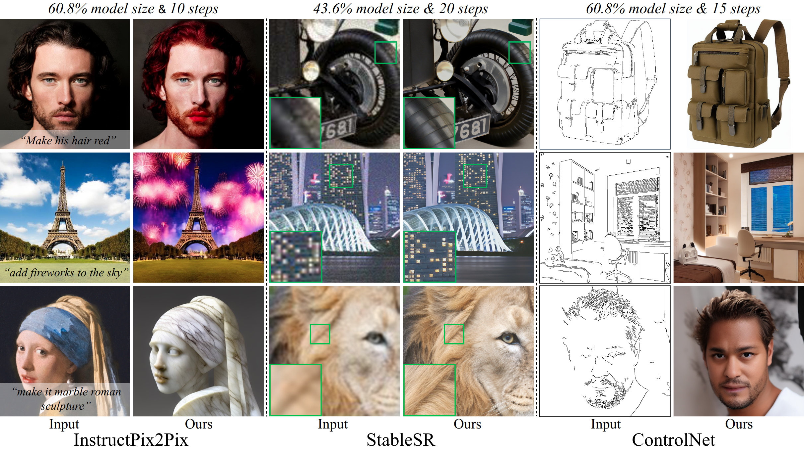

<div align="center">

<h1>
    ID-Compression:<br> 
    Diffusion Model Compression for Image-to-Image Translation
</h1>

<div>
    <a href='https://kimgeonung.github.io/' target='_blank'>Geonung Kim</a>&emsp;
    <a target='_blank'>Beomsu Kim</a>&emsp;
    <a target='_blank'>Eunhyeok Park</a>&emsp;
    <a href='https://www.scho.pe.kr/' target='_blank'>Sunghyun Cho</a>&emsp;
</div>
<div>
    POSTECH
</div>

<div>
    <strong>ACCV 2024 </strong>
</div>

<div>
    <h4 align="center">
        <a href="https://kimgeonung.github.io/id-compression/" target='_blank'>
        
        </a>
        <a href="https://arxiv.org/abs/2401.17547" target='_blank'>
        
        </a>
    </h4>
</div>

 
---

</div>

## 🔥 Update

- [2024.10.09] Depth-skip compression code is released
- [2024.10.08] The repository is created.


## 🔧 Install Environment

### Clone Repository

```bash
git clone git@github.com:KIMGEONUNG/ID-compression.git
```

### Conda Environment

We offer three applications using our compression method: InstructPix2Pix for image editing, StableSR for image restoration, and ControlNet for structure-guided image synthesis. Please refer to the original application repository to install the conda environments.

- [InstructPix2Pix](https://github.com/timothybrooks/instruct-pix2pix/tree/main)
- [StableSR](https://github.com/IceClear/StableSR)
- [ControlNet](https://github.com/lllyasviel/ControlNet )

### Checkpoints

The checkpoint paths for each task are as follows. Please refer to the original repository to download the checkpoints.

```bash
# For InstructPix2Pix
InstructPix2Pix/ckpts
└── instruct-pix2pix-00-22000.ckpt

# For StableSR
StableSR/ckpts
├── stablesr_000117.ckpt
└── vqgan_cfw_00011.ckpt

# For ControlNet
ControlNet/models
└── control_sd15_canny.pth 
```

## ⌨️  Quick Start

### InstructPix2Pix

```bash
cd InstructPix2Pix
python depth-skip.py --depth 9
```

### StableSR

```bash
cd StableSR
python depth-skip.py --depth 9
```

### ControlNet

```bash
cd ControlNet
python depth-skip.py --depth 9
```

## ☕️ Acknowledgment

- We borrowed the readme format from [Upscale-A-Video](https://github.com/sczhou/Upscale-A-Video) 
